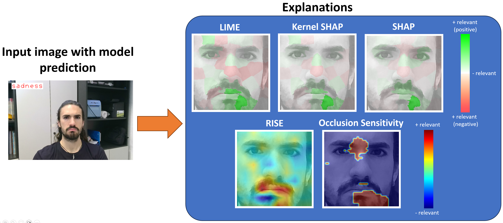

# Robot Vision

Módulo de visión para cualquier robot, presentado en el congreso INTERACCION'24: [*"An AI-Powered Computer Vision Module for Social Interactive Agents"*](https://doi.org/10.1145/3657242.3658601).

Ver robot_vision/notebooks/Module Testing.ipynb para ver ejemplos de cómo usar las herramientas de visión.


## Instalación

### Prerequisitos

* Para desarrollar el módulo se ha usado Windows 10. Todavía no se ha provado en otros sistemas operativos.
* Para algunos paquetes es necesario tener instaladas las [Microsoft C++ Build Tools](https://visualstudio.microsoft.com/es/visual-cpp-build-tools/). Después de descargar el ejecutable, seleccionar la opción "Desktop development with C++", y en los detalles de instalación quitar Windows 11 SDK y añadir Windows 10 SDK (si se usa Windows 10).
* También es necesario tener instalado [Git](https://git-scm.com/book/en/v2/Getting-Started-Installing-Git).
* Y Anaconda o [Miniconda](https://docs.anaconda.com/free/miniconda/index.html), para instalar el módulo dentro de un nuevo entorno.

### Instalar paquetes y robot_vision
Se recomienda crear un nuevo entorno (environment) para la instalación del módulo. La versión de Python usada para desarrollar el módulo es la 3.8.18. También es necesario instalar CUDA 11.8 para usar la GPU en la inferencia.

    conda create -n vision-module python=3.8.18
    conda activate vision-module
    git clone https://github.com/Xavi3398/robot_vision
    cd robot_vision
    pip install -r requirements1.txt (o bien pip install -r requirements1-CPU.txt si no se usa CUDA)
    pip install -r requirements2.txt
    pip install -r requirements3.txt
    pip install -e .

### Añadir subcarpetas
Para los pesos de los modelos hay que crear una carpeta "models" dentro de robot_vision/robot_vision, y ponerlos ahí.
Para la tarea de reconocimiento facial hay que crear una carpeta "user_faces" dentro de robot_vision/robot_vision, y poner ahí las imágenes de los usuarios a reconocer. 

### Arreglar errores de paquetes específicos
Hay que cambiar dos líneas del código fuente de MiVOLO:
* robot_vision/src/mivolo/mivolo/structures.py -> comentar línea 14: # os.unsetenv("CUBLAS_WORKSPACE_CONFIG")
* robot_vision/src/mivolo/mivolo/model/yolo_detector.py -> comentar línea 12: # os.unsetenv("CUBLAS_WORKSPACE_CONFIG")

Hay que añadir manualmente los pesos de SPIGA porque no se descargan bien automáticamente:
* Copiar robot_vision/robot_vision/models/spiga_wflw.pt en robot_vision/src/spiga/spiga/models/weights

Si no se usa CUDA, hay que eliminar su uso en el paquete de SPIGA (archivo src/spiga/spiga/inference/framework.py):
* Comentar línea 45: self.model = self.model.cuda(gpus[0])
* Cambiar línea 136: data_var = data.cuda(device=self.gpus[0], non_blocking=True) por data_var = data

Si no se usa CUDA, cambiar también llamada a MiVOLO:
* En archivo robot_vision/recognition/predefined.py, función predefined_age_gender_MiVOLO(), añadir device='cpu' a la llamada a age_gender.MiVOLOAgeGender

## Instrucciones para usar el módulo de visión

### Arrancar el módulo, junto con el programa cliente de prueba
1. Ir a carpeta robot_vision/vision_module.
2. Ejecutar 'python cv_server.py' para iniciar el servidor.
3. Ejecutar (en otra terminal) 'python client.py' para iniciar un cliente de prueba, que graba vídeo desde la webcam y lo envía al servidor para que lo procese. Se puede elegir entre diferentes tareas y métodos. Para parar reconocimiento y cambiar de tarea/método hay que pulsar botón derecho del ratón o 'q' con el focus puesto en la ventana de la cámara (no en la terminal), y luego escribir 'y' en la terminal para continuar o 'n' para parar.
4. Si se ha seleccionado el modo imagen en vez de vídeo, sólo se procesan las capturas de pantalla, no todo el vídeo. Para hacer una captura de pantalla, hacer click izquierdo con el ratón en la ventana de la grabación.

Para parar tanto el servidor como el cliente es necesario usar Ctrl+c repetidas veces en las consolas de comandos, debido a la ejecución multiproceso. Esto se arreglará en una versión futura.

### Peticiones:
El módulo, tal como está configurado, contesta peticiones en http://127.0.0.1:8080 (localhost, puerto 8080). Acepta dos clases de peticiones:

 - POST de una imagen (modo imagen).
 - Mensajes a través de sockets con fotogramas a procesar (modo vídeo)

#### Modo imagen

Petición POST a http://127.0.0.1:8080/sendImage. Este modo está pensado para procesar imágenes a petición (no en tiempo real). Por ejemplo, hacer una captura de pantalla en un momento determinado y procesarla para identificar el usuario delante de la cámara.

Parámetros con nombre:

 - **task**: tarea a realizar. Disponibles: *'face_detection', 'person_detection', 'keypoints', 'expression', 'age_gender', 'face_recognition', 'background_subtraction'*.
 - **method**: método a utilizar. Depende de la tarea. Ver diccionario PREDEFINED_RECOGNIZERS en robot_vision/recognition/predefined.py para la lista completa.
 - **mode**: tipo de respuesta de la petición. Disponibles: *'text'* (devuelve texto con el resultado del reconocimiento), *'plot'* (devuelve la imagen de entrada con el resultado pintado encima).

Cuerpo del POST: la imagen a procesar, en bytes, comprimida en jpg y en base 64.

#### Modo vídeo en tiempo real

Envío de mensajes a través de sockets a http://127.0.0.1:8080/videoStream/sendFrame (namespace='/videoStream'). Pensado para enviar vídeo en tiempo real. Parámetros (sin nombre):

- la imagen a procesar, en bytes, comprimida en jpg y en base 64.
- tarea a realizar. Disponibles: *'face_detection', 'person_detection', 'keypoints', 'expression', 'age_gender', 'face_recognition', 'background_subtraction'*.
- método a utilizar. Depende de la tarea. Ver diccionario PREDEFINED_RECOGNIZERS en robot_vision/recognition/predefined.py para la lista completa.
- tipo de respuesta de la petición. Disponibles: *'text'* (devuelve texto con el resultado del reconocimiento), *'plot'* (devuelve la imagen de entrada con el resultado pintado encima).

Los resultados del reconocimiento se emiten, también a través de sockets, en:

- http://IP_CLIENTE:PUERTO_CLIENTE/videoStream/sendPlot si el modo es *'plot'*.
- http://IP_CLIENTE:PUERTO_CLIENTE/videoStream/sendText, si el modo es *'text'*.

## Tareas y modelos disponibles

| **Task**                   | **Year** | **Method**             | **Speed (imgs/s)** | **Accuracy**  | **Additional notes**                                                                    | **Implementation**                                              |
|------------------------|------|--------------------|----------------|-----------|-------------------------------------------------------------------------------------|-------------------------------------------------------------|
| Face detection         | 2023 | YOLOv8             | 85.51          | Very Good |                                                                                     | [Official code](https://github.com/ultralytics/ultralytics) |
|                        | 2021 | SCRFD              | 547.38         | Very Good |                                                                                     | [InsightFace](https://github.com/deepinsight/insightface)   |
|                        | 2016 | MTCNN              | 1.69           | Very Good |                                                                                     | [TensorFlow](https://github.com/ipazc/mtcnn)                |
|                        | 2005 | HOG + SVM          | 7.97           | Good      |                                                                                     | [DLIB](http://dlib.net/python)                              |
|                        | 2001 | Viola-Jones (face) | 5.75           | Fair      | Requires good choice of hyperparameters to get good results.                        | [OpenCV](https://docs.opencv.org/3.4)                       |
| Face recognition       | 2015 | ResNet50           | 15.73          | Very Good |                                                                                     | [InsightFace](https://github.com/deepinsight/insightface)   |
| Person detection       | 2023 | YOLOv8             | 76.24          | Very Good |                                                                                     | [Official code](https://github.com/ultralytics/ultralytics) |
| Facial landmarks       | 2022 | SPIGA              | 11.19          | Very Good | **98 landmarks**.                                                                       | [Official code](https://github.com/andresprados/SPIGA)      |
|                        | 2017 | MobileNet          | 122.87         | Very Good | **106 landmarks**.                                                                      | [InsightFace](https://github.com/deepinsight/insightface)   |
|                        | 2016 | MTCNN              | 0.82           | Good      | **5 landmarks**: eye_left, eye_right, nose, mouth_left, mouth_right.                    | [TensorFlow](https://github.com/ipazc/mtcnn)                |
|                        | 2014 | Regression Trees   | 56.88          | Good      | **68 landmarks**.                                                                       | [DLIB](http://dlib.net/python)                              |
|                        | 2001 | Viola-Jones (eyes) | 10.19          | Fair      | **2 landmarks**: the eyes. Requires good choice of hyperparameters to get good results. | [OpenCV](https://docs.opencv.org/3.4)                       |
| Age and gender         | 2023 | MiVOLO             | 10.78          | Very Good |                                                                                     | [Official code](https://github.com/WildChlamydia/MiVOLO)    |
|                        | 2017 | MobileNet          | 91.73          | Good      | Does not work for children.                                                         | [InsightFace](https://github.com/deepinsight/insightface)   |
| Expression recognition | 2022 | SilNet             | 5.92           | Very Good |                                                                                     | [Keras](https://keras.io/api/applications)                  |
|                        | 2021 | EfficientNetV2     | 4.99           | Very Good |                                                                                     | [Keras](https://keras.io/api/applications)                  |
|                        | 2019 | MobileNetV3        | 5.60           | Very Good |                                                                                     | [Keras](https://keras.io/api/applications)                  |
|                        | 2017 | Xception           | 5.62           | Very Good |                                                                                     | [Keras](https://keras.io/api/applications)                  |
|                        | 2015 | InceptionV3        | 2.99           | Very Good |                                                                                     | [Keras](https://keras.io/api/applications)                  |
|                        | 2015 | ResNet50           | 4.51           | Very Good |                                                                                     | [Keras](https://keras.io/api/applications)                  |
|                        | 2015 | ResNet101V2        | 3.93           | Very Good |                                                                                     | [Keras](https://keras.io/api/applications)                  |
|                        | 2015 | VGG16              | 4.72           | Very Good |                                                                                     | [Keras](https://keras.io/api/applications)                  |
|                        | 2015 | VGG19              | 4.39           | Very Good | This is the model we have tested the most.                                          | [Keras](https://keras.io/api/applications)                  |
|                        | 2015 | WeiNet             | 6.95           | Very Good |                                                                                     | [Keras](https://keras.io/api/applications)                  |
|                        | 2014 | SongNet            | 6.34           | Very Good |                                                                                     | [Keras](https://keras.io/api/applications)                  |
|                        | 2012 | AlexNet            | 6.60           | Very Good | Good choice if the extra speed is required.                                         | [Keras](https://keras.io/api/applications)                  |
| Background subtraction | 2020 | U2-Net             | 2.53           | Very Good |                                                                                     | [RemBG](https://github.com/danielgatis/rembg)               |

Ejemplos:


## Explicabilidad

| **Method**            | **Speed** | **_'Quality'_** | **Segmentation** | **Relevance**         |
|-----------------------|-----------|---------------|------------------|-----------------------|
| LIME                  | Medium    | Good          | SLIC superpixels | Positive and Negative |
| SHAP                  | Slow      | Good          | SLIC superpixels | Positive and Negative |
| Kernel SHAP           | Medium    | Good          | SLIC superpixels | Positive and Negative |
| RISE                  | Medium    | Good          | Grid             | Heatmap               |
| Occlusion Sensitivity | Medium    | Medium        | Grid             | Heatmap               |
| LOCO                  | Fast      | Bad           | SLIC superpixels | Positive and Negative |
| Univariate Predictors | Fast      | Very bad      | SLIC superpixels | Positive and Negative |

***Nota***:  *Para los métodos que ofrecen relevancia positiva y negativa, se puestra en verde la positiva y en rojo la negativa. La relevancia positiva indica aquellas regiones que, al ser eliminadas, impiden al modelo reconocer la clase. La importancia negativa indica aquellas regiones que al ser eliminadas, ayudan al modelo a reconocer la clase.*

Ejemplos:


## Licencia
Este proyecto está licenciado bajo los términos de la licencia MIT. Consulte el archivo [LICENSE](LICENSE) para más detalles.

## Agradecimientos
This work is part of the Project PID2022-136779OB-C32 (PLEISAR) funded by MICIU/ AEI /10.13039/501100011033/ and FEDER, EU. Project Playful Experiences with Interactive Social Agents and Robots (PLEISAR): Social Learning and Intergenerational Communication.

Grant PID2019-104829RA-I00 funded by MCIN/ AEI /10.13039/501100011033. Project EXPLainable Artificial INtelligence systems for health and well-beING (EXPLAINING).

F. X. Gaya-Morey was supported by an FPU scholarship from the Ministry of European Funds, University and Culture of the Government of the Balearic Islands.

## Cita
Si usa este código en su investigación, por favor cite nuestro artículo:

```
@inproceedings{gaya_morey2024ai,
	title        = {An AI-Powered Computer Vision Module for Social Interactive Agents},
	author       = {Gaya Morey, Francesc Xavier and Manresa-Yee, Cristina and Buades Rubio, Jose Maria},
	year         = 2024,
	booktitle    = {Proceedings of the XXIV International Conference on Human Computer Interaction},
	location     = {A Coru\~{n}a, Spain},
	publisher    = {Association for Computing Machinery},
	address      = {New York, NY, USA},
	series       = {Interacci\'{o}n '24},
	doi          = {10.1145/3657242.3658601},
	isbn         = 9798400717871,
	articleno    = 19,
	numpages     = 5
}
```

